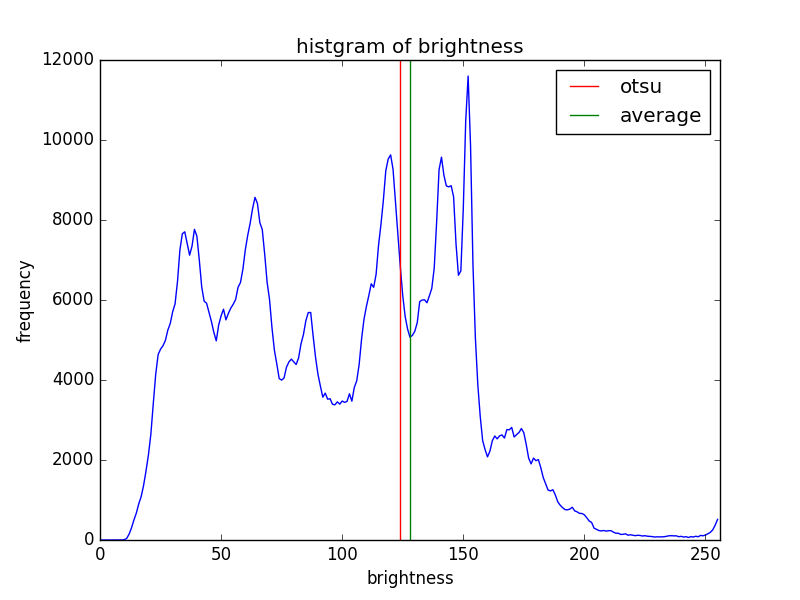
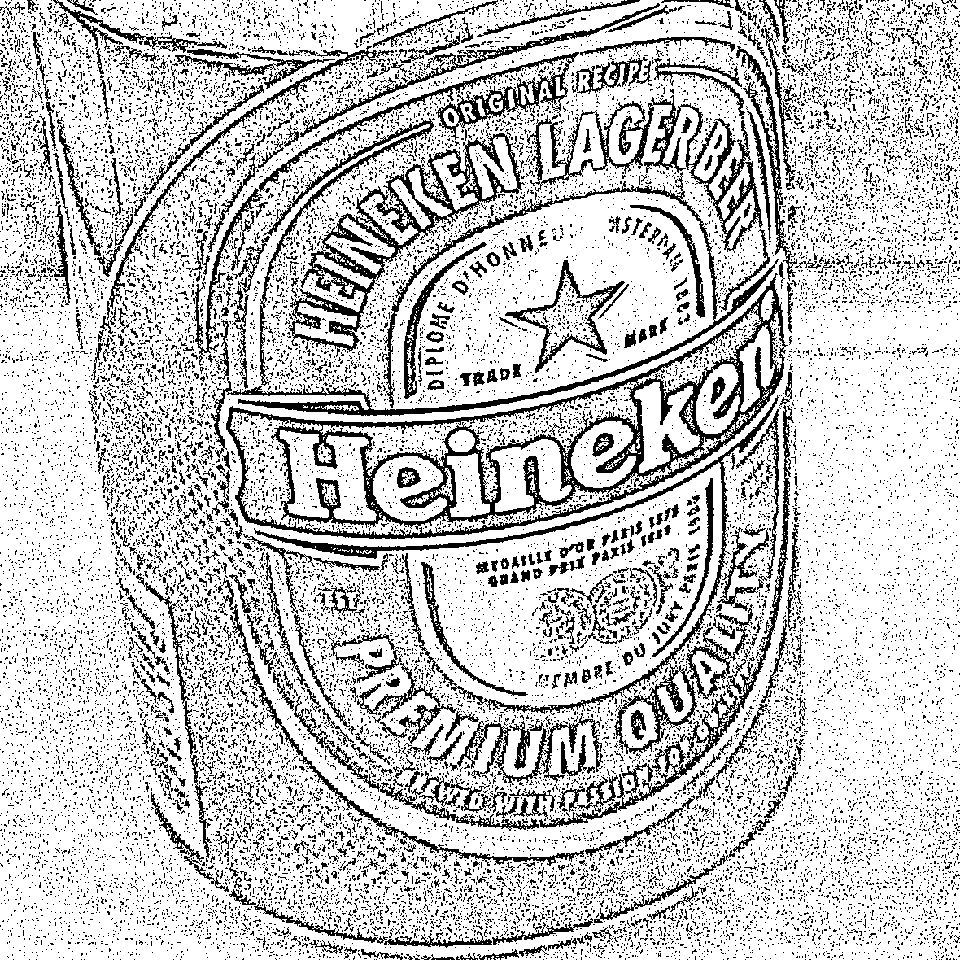

#Otsu thresholding method
##Abstract
Implement otsu-thresholding method. It's useful to create a 2 intensity image.

##Requirements
-Python 3.x (checked Python 3.4.3)  
-numpy(checked matplotlib 1.11.0)  
-pylab(checked matplotlib 1.5.0)  
-OpenCV(checked OpenCV 3.0)  
##How to use
-prepare sample image(.jpg)  
-python otsu_threshold.py

##Result
original image is as following.  

applied otsu method to the original one is as following.  

threshold is 128 intensity to create a 2 intensity image.  

original image's intensity histogram with static threshold(128) and otsu threshold are as following.  

Used 'Adaptive_Gaussian_Thresholoding'. It is included in OpenCV.  

